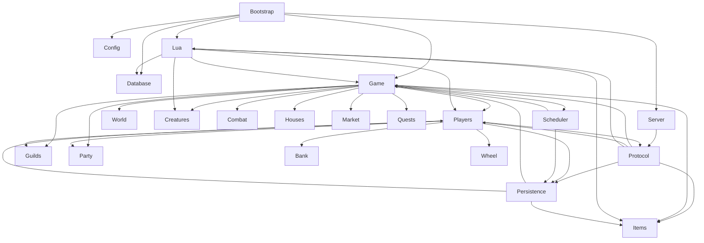

# Current engine ownership and dependency inventory

Status: **MGE-001 evidence baseline**  
Target repository: `blakinio/Otheryn`  
Issue: `#127`  
Source-analysis revision: `38bb62192d25984d63f96c2637348b4adc82f6cd`  
Analysis date: `2026-07-26`  
Runtime behavior changed by this package: **no**

## Evidence vocabulary

- **PROVEN** — directly supported by revision-pinned code, repository state, exact diff, test, build, or deterministic check.
- **DERIVED** — a constrained conclusion from one or more PROVEN observations.
- **TARGET** — desired architecture from `docs/architecture/modular-game-engine-and-profiles.md`; it is not current behavior.
- **UNKNOWN** — available evidence is insufficient.

Repository labels:

- `OTHERYN_CURRENT`
- `CANARY_FORK_REFERENCE`
- `CANARY_UPSTREAM_REFERENCE`
- `TARGET`

The report does not treat a directory as a module. Include inspection is used as evidence of compile-time coupling, not as a claim of a complete compiler-derived dependency graph.

---

## 1. Repository and revision baseline

| Repository role | Repository | Revision | Classification |
|---|---|---:|---|
| target | `blakinio/Otheryn` | `38bb62192d25984d63f96c2637348b4adc82f6cd` | OTHERYN_CURRENT / PROVEN |
| migration reference | `blakinio/canary` | `ec0d815570415a4c7ca7217e3e2aca41f6023dab` | CANARY_FORK_REFERENCE / PROVEN |
| upstream reference | `opentibiabr/canary` | `7644bcbcbbad4a09e52a5707ed531e4dd21d8a79` | CANARY_UPSTREAM_REFERENCE / PROVEN |
| architecture target | `docs/architecture/modular-game-engine-and-profiles.md` | blob `5dfe3ed739383896f81b5b9aefdc2dd0fe039cfa` on target revision | TARGET / PROVEN |

### Open Otheryn pull requests at baseline

| PR | State | Exact changed paths | Ownership assessment |
|---|---|---|---|
| `#126` party-test teardown UAF | open, non-draft | `.github/workflows/party-test-sanitizer.yml`; `docs/agents/tasks/active/OTH-20260726-party-test-teardown-segfault.md`; `tests/unit/players/party_test.cpp` | no changed-path conflict; relevant evidence for Party/Lua/test-lifecycle risk |
| `#123` PRS-001 backup/PITR | open, draft | `.github/workflows/prs001-backup-pitr.yml`; `config.lua.dist`; `docs/agents/tasks/active/OTH-20260726-prs001-backup-pitr-foundation.md`; `docs/operations/backup-and-pitr.md`; Docker backup scripts/config; integration drill | no changed-path conflict; adjacent production-resilience work only |

At baseline, comments, reviews, and review threads returned empty for both open PRs. **PROVEN**.

No issue, branch, task, report, or PR for `MGE-001` existed before issue `#127` and branch `dudantas/mge-001-ownership-dependency-inventory` were created. **PROVEN**.

The modularity contract remained on `main`. Comparing its original architecture merge with the baseline showed no change to `docs/architecture/modular-game-engine-and-profiles.md`; the later commit only moved the contract task from active to archive. No newer architecture decision overriding MGE-001 was found. **PROVEN for inspected repository state**.

### Active tasks and ownership

The baseline active-task owners visible through open PR changed paths were:

- `OTH-20260726-party-test-teardown-segfault.md` — test teardown and Party/Lua lifetime work.
- `OTH-20260726-prs001-backup-pitr-foundation.md` — backup/PITR operations work.

Neither owns the MGE-001 report path. MGE-001 owns only:

- `docs/architecture/current-engine-ownership-and-dependencies.md`
- `docs/agents/tasks/active/OTH-20260726-mge001-ownership-dependency-inventory.md`

### Analysis limitations

- No local network clone was available; source inspection and writes used revision-pinned GitHub API data.
- No compiler-generated whole-program include graph was produced. Compile-time edges and cycles below are manually validated from source/CMake evidence.
- Runtime frequency of each edge is not established.
- Canary was inspected only for the first-extraction decision and material semantic differences.
- `UNKNOWN` is retained whenever authoritative ownership, crash behavior, generation validation, or transaction semantics were not proved.

---

## 2. Runtime composition map

### Startup

```text
main
  -> resolve DI services
  -> construct CanaryServer
  -> configure signals / process runtime
  -> CanaryServer::run
     -> initialize dispatcher/thread pool
     -> load config.lua through ConfigManager
     -> initialize logging/metrics/RSA
     -> connect Database and run database checks/migrations
     -> load items, vocations, groups and static registries
     -> initialize LuaEnvironment and script systems
     -> load map, houses, monsters, NPCs, raids and world data
     -> initialize Game-owned/global gameplay systems
     -> register login/status/game protocol services
     -> start ServiceManager listeners
     -> set Game state and publish readiness
     -> run watchdog/dispatcher loop
```

**PROVEN:** `main.cpp`, `canary_server.cpp`, and `canary_server.hpp` establish the process entry, DI-resolved server construction, bootstrap orchestration, service listener start, readiness transition, and shutdown call chain.

The example flow in the MGE task was not used as evidence; the order above follows the inspected implementation.

### Configuration

`ConfigManager::load()` creates/uses a Lua state to evaluate `config.lua`, stores values in mutable enum-indexed maps, and is exposed through `g_configManager()`. Reload behavior is selective rather than an immutable typed snapshot. **PROVEN**.

### Database

`Database` is a DI-resolved singleton with a process-wide MySQL handle and recursive mutex. `DBTransaction` owns begin/commit/rollback around the same singleton. `DatabaseTasks` dispatches SQL work to the worker pool and posts callbacks back to the dispatcher. **PROVEN**.

### Lua

`LuaEnvironment` owns the shared Lua state, timer-event references, combat areas, and child-interface registry. Bootstrap initializes script systems after core/static data and before readiness. Reload closes the shared state, rebuilds it, then reinitializes registered child interfaces. **PROVEN**.

### World and gameplay

`Game` owns `Map`, online/dead creature registries, guild/group state, item-decay state, trade/party coordination entry points, world state, and a large set of gameplay orchestration methods. It also owns an `IOWheel` instance. **PROVEN**.

### Protocols and listeners

`ServiceManager` binds protocol services after world/script bootstrap. `Protocol::onRecvMessage` decodes input and schedules parsing through the dispatcher `ProtocolInput` lane. `ProtocolGame` then parses opcodes and calls Game, Player, IO, Lua module, and feature-specific methods. **PROVEN**.

### Shutdown and destruction

```text
shutdown request
  -> stop accepting normal game work
  -> Game shutdown/save paths
  -> dispatcher shutdown/drain policy
  -> service manager / connection shutdown
  -> worker pool shutdown
  -> LuaEnvironment::shutdown / close shared state
  -> CanaryServer and DI/static process destruction
```

Explicit shutdown methods exist, but the final relative destruction order of all function-local static DI services and registries is not encoded in a composition-root type. Open PR `#126` is evidence that test teardown can expose a static-registry/Lua lifetime error. **PROVEN/DERIVED**.

---

## 3. Global and singleton inventory

| Symbol/access path | Definition | Construction/destruction | Owned state and authority | Thread/persistence risk | Candidate target owner | Evidence |
|---|---|---|---|---|---|---|
| `g_game()` | `src/game/game.hpp` | DI function-static; process lifetime | Map, world state, online/dead creatures, guild/group registries, item decay, trade and gameplay orchestration | broad mutation from dispatcher/Lua; save orchestration | composition root plus explicit core/world services | PROVEN |
| `g_configManager()` | `src/config/configmanager.hpp/.cpp` | DI function-static; mutable reload | string/number/boolean config maps | readers can observe mutable global configuration; typed atomic snapshot absent | typed profile/config snapshot service | PROVEN/TARGET gap |
| `g_database()` / `Database::getInstance()` | `src/database/database.hpp` | DI/static; MySQL handle destructor | concrete SQL connection, transaction primitives | global concrete persistence; recursive lock; domain boundaries hidden | infrastructure database port | PROVEN |
| `g_databaseTasks()` | `src/database/databasetasks.hpp` | DI/static | worker SQL submission and callbacks | callback generation validation is caller-specific | persistence executor | PROVEN |
| `g_dispatcher()` | `src/game/scheduling/dispatcher.hpp` | DI/static; explicit shutdown flag | lane queues, delayed/cycle tasks, task telemetry | arbitrary closures; lifecycle and producer tokens not domain ownership | execution runtime owned by composition root | PROVEN |
| `g_threadPool()` | `src/lib/thread/thread_pool.hpp` | DI/static; explicit shutdown | generic worker threads | detached task lifetime varies by caller | infrastructure worker executor | PROVEN |
| `g_luaEnvironment()` | `src/lua/scripts/lua_environment.hpp` | DI/static; explicit shutdown and destructor fallback | shared Lua state, timers, combat areas, interface state | raw interface registry, callbacks, direct domain/SQL authority | Lua runtime service with bounded adapters | PROVEN |
| `g_saveManager()` | `src/game/scheduling/save_manager.hpp` | DI/static | save scheduling maps and player/guild/map/KV orchestration | parallel player serialization; destructor-triggered Bank saves | persistence coordinator | PROVEN |
| `Item::items` | item definitions | static registry loaded at bootstrap | mutable global item-type definitions | read throughout Game, ProtocolGame, Lua, persistence | item catalog core module | PROVEN |
| `ProtocolProfileRegistry` | protocol profile files | static registry | profile/wire capability selection | protocol-global state | typed protocol capability registry | PROVEN |
| Lua interface registry | `lua_environment.cpp` anonymous namespace | function-local static registry | raw `LuaScriptInterface*` membership | teardown-order UAF risk demonstrated by active work | Lua runtime-owned registry with explicit lifetime | PROVEN |
| `g_eventsScheduler()` | `src/game/scheduling/events_scheduler.hpp` | DI/static | mutable rate/event schedule state | global gameplay-rate mutation | rules/event module | PROVEN |
| `IOMarket::getInstance()` | `src/io/iomarket.hpp` | DI/static | market statistics cache; static concrete SQL operations | public header includes DB types; protocol/economy coupling | future market application/persistence ports | PROVEN |
| `g_playerStorageRepository()` | player storage repository | DI/static | concrete storage persistence | dirty delta without general revision fence | player-storage repository port | PROVEN |
| `g_RSA()`, logger, metrics, KV, chat, modules, scripts, monsters, vocations | DI/static accessors in respective headers | process/static lifetime | infrastructure and registries | hidden construction/lifetime dependencies | composition-root-owned services | PROVEN for inspected accessors |

### Service-locator conclusion

`inject<T>()` resolves from a process container and tests can replace/reset container bindings. This is a service locator even when individual classes expose constructor parameters. Many `getInstance()` methods delegate to `inject<T>()`, and `constexpr auto g_*` accessors make service reachability global. **PROVEN**.

No single explicit object currently owns the complete startup and reverse-shutdown graph. **DERIVED**.

---

## 4. State ownership matrix

| State | Current storage location | Creator | Readers | Writers / authoritative writer | Thread / dispatcher | Durability and save path | Reload/crash/stale protection | Evidence | Target module |
|---|---|---|---|---|---|---|---|---|---|
| world state | `Game` | DI/bootstrap | protocol, scripts, systems | Game methods; Game is practical coordinator | dispatcher world lanes | selected state through saves | restart reloads sources; no universal revision | PROVEN | core world/runtime |
| map | `Game::map` / `Map` | Game/bootstrap | Game, protocol, Lua, pathing | Game and Map methods; authoritative boundary shared | world/parallel pathing contexts | OTBM source plus `Map::save`/IOMapSerialize | reload is explicit; crash guarantees UNKNOWN | PROVEN | world/map core |
| tiles | Map cache/tree and `Tile` objects | map loader/dynamic creation | Game, creatures, protocol, Lua | Map/Game/Tile/Cylinder paths; authoritative writer UNKNOWN as one interface | dispatcher world lane expected | map/house persistence selectively | topology epoch exists; broad mutation revision absent | PROVEN/UNKNOWN | world/map core |
| creatures | Game registries + shared Creature objects | Game/spawn/load | Game, protocol, Lua, AI | Game/Creature/combat/scripts; multiple writers | dispatcher plus bounded async work | monster/NPC mostly transient | runtime IDs are not universal generation fences | PROVEN | creature runtime |
| players | Game registries + Player aggregate | ProtocolGame/login | all gameplay/protocol/Lua/IO | Player, Game, combat, Lua, feature components; no exclusive writer interface | dispatcher; SaveManager worker under PlayerLock | IOLoginData SQL + feature SQL/KV | exact object pinned for save; no persisted player revision | PROVEN | player core plus feature modules |
| sessions | ProtocolGame/Connection/LoginSessionManager | network/login | protocol/auth | connection/protocol/session manager | network then ProtocolInput | session/token storage implementation-specific | token consume semantics exist; crash behavior UNKNOWN | PROVEN/UNKNOWN | session/auth core |
| connections | Connection/ServiceManager | network accept | protocol/services | Connection and network code | asio/network | none | weak references and close paths; final ordering implicit | PROVEN | network core |
| inventory | `Player::inventory`, Container/Item graph | load/loot/game | Player, Game, protocol, Lua | Game/Player/Cylinder/Lua; multiple writers | dispatcher; serialized under PlayerLock | player_items delete+recursive insert in player transaction | no item revision/fence | PROVEN | items/inventory core |
| containers | Container object graph/open-container map | item creation/load | protocol, player, Lua, save | Game/Container/Player/Lua; save mutates open-container attributes | dispatcher/save worker under lock | player/depot/inbox tables | object graph snapshot; no independent version | PROVEN | items/inventory core |
| items | shared Item objects + static `Item::items` definitions | factories/loaders | all domains | Game/Cylinder/Item/Lua | dispatcher; selected async reads | player/map/market/house paths | ownership crosses domains | PROVEN | item core |
| combat state | Creature/Player/Condition/Combat | gameplay/script | combat/protocol/Lua | Combat, Game, Creature, Player, Lua | dispatcher and selected async lanes | persistent conditions in player save | generation policy is callback-specific | PROVEN | combat gameplay |
| conditions | Creature condition list | combat/load | combat/protocol/Lua/IO | Creature/Combat/Lua | dispatcher | serialized with player | no revision | PROVEN | combat/player |
| deaths | Player/Creature plus IO tables/history | combat | protocol/Lua/IO | combat/Game/IO | dispatcher + persistence | player death/history SQL | business crash semantics UNKNOWN | PROVEN/UNKNOWN | death gameplay |
| houses | `Map::houses`, House objects | map/house load | Game, protocol, Lua | House/Game/IOMapSerialize/Lua | dispatcher | map/SQL house paths | cross-path consistency UNKNOWN | PROVEN/UNKNOWN | houses gameplay |
| guilds | Game guild registry + Guild | load/create | Player, party, protocol, Lua | Guild/Game/Lua/IOGuild | dispatcher; SaveManager | IOGuild | transaction/revision coverage UNKNOWN | PROVEN/UNKNOWN | guild gameplay |
| party | Party object; Player links; Party vectors/maps | `Party::create` | Player/protocol/combat/Lua | Party methods, Game adapters; Party practical writer | dispatcher | no durable party persistence found | volatile; teardown test risk | PROVEN | party gameplay |
| market | SQL offers/history + IOMarket statistics + Player/Item state | protocol/IO | ProtocolGame/Game/Lua | ProtocolGame/Game/IOMarket/Player; authoritative business writer UNKNOWN | dispatcher + DB callbacks | concrete market SQL | idempotency/fencing/crash atomicity UNKNOWN | PROVEN/UNKNOWN | market gameplay |
| bank | `Player::bankBalance`, Guild balance via Bankable | load | Bank/Player/Lua/IO | Bank, direct setters, IO increment, Lua/NPC; authoritative writer UNKNOWN | dispatcher; save worker | player balance column/IOGuild | transfer operation identity/fencing absent | PROVEN/UNKNOWN | economy/bank gameplay |
| trade | Game trade maps + Player state/items | protocol/Game | participants/protocol | Game/Player | dispatcher | eventual player save | crash atomicity UNKNOWN | PROVEN/UNKNOWN | trade gameplay |
| quests | Lua/content + Player storage/quest log | scripts/protocol | Lua/Player/protocol | Lua and storage APIs | dispatcher/Lua | player storage tables | reload semantics content-specific | PROVEN/UNKNOWN | quest/content boundary |
| storages | PlayerStorage component dirty delta | load/repository | gameplay/Lua | PlayerStorage/Lua | dispatcher; save worker under lock | delete/upsert in player SQL transaction | dirty tracking; no persisted revision | PROVEN | player storage gameplay |
| Wheel | PlayerWheel component + Game-owned IOWheel + KV | Player/bootstrap | protocol/combat/Lua | PlayerWheel/ProtocolGame/Lua | dispatcher | SQL in player transaction; KV staged after commit | no cross-store transaction/outbox | PROVEN | Wheel gameplay |
| Prey | Player-owned slot objects | load/player | protocol/combat/Lua | Player/ProtocolGame/Lua | dispatcher | per-slot SQL upsert in player transaction | no revision/fence | PROVEN | Prey gameplay |
| Bestiary | Player sets/resources + Game monster data | load/bootstrap | protocol/combat/Lua | Player/ProtocolGame/Lua/IO | dispatcher | player_charms/bestiary SQL | no revision | PROVEN | Bestiary gameplay |
| Charms | Player arrays/bitsets/resources | load | combat/protocol/Lua | Player/Lua/protocol feature logic | dispatcher | player_charms SQL | no revision | PROVEN | Charms gameplay |
| Forge | Player columns/history/components + Game/Protocol | load | protocol/Lua/game | Player/ProtocolGame/forge components | dispatcher | player columns + history SQL | operation identity UNKNOWN | PROVEN/UNKNOWN | Forge gameplay |
| Lua registrations | Lua state, interface registry, event objects | bootstrap/reload/scripts | Lua runtime/dispatch | registration APIs and reload | dispatcher/bootstrap | script files only | close/reinit; external raw-reference safety incomplete | PROVEN/UNKNOWN | Lua runtime |
| scheduled tasks | Dispatcher queues/maps; SaveManager maps | callers | dispatcher/scheduler | callers/dispatcher | dispatcher and worker pool | none | expiration/tokens exist; generation validation caller-specific | PROVEN | execution runtime |
| database transactions | Database singleton/MySQL session | DBTransaction | IO/repositories/Lua | transaction owner is each caller | caller/worker threads serialized by DB lock | MySQL commit | no universal business idempotency/fencing | PROVEN | persistence infrastructure |
| configuration | ConfigManager maps | bootstrap/reload | virtually all systems | ConfigManager load/reload | bootstrap/dispatcher assumptions | config.lua | immutable atomic snapshot absent | PROVEN | typed profile/config core |
| protocol capabilities | ProtocolProfileRegistry/profile pointers | static/bootstrap | login/game protocol | registry/config selection | network/dispatcher | code/config | profile pointer per session; gameplay capability ownership mixed | PROVEN | protocol core |

Where several writers exist, the table does not invent an authoritative owner. `UNKNOWN` is deliberate.

---

## 5. Compile-time dependency graph

### Build composition

The main core target includes most engine directories through one CMake target. Directory-level CMake files primarily append source files to that target rather than form enforceable library boundaries. **PROVEN**.



### Manually validated high-risk cycles/back-edges

| Cycle/back-edge | Evidence | Assessment |
|---|---|---|
| ProtocolGame -> Player and Player -> ProtocolGame | concrete includes/friend/client methods | compile-time and runtime cycle; PROVEN |
| Game -> Player/Creature/Item and those types -> Game services | headers/cpp accessors | central-domain cycle; PROVEN |
| Lua bindings -> private concrete domain types -> protocol/Game | Player binding includes concrete Player, ProtocolGame, IO and Game | Lua adapter is not bounded; PROVEN |
| persistence -> Game/Player/Item and gameplay -> persistence | IOLoginData/SaveManager/Game includes and calls | domain-to-concrete-persistence back-edge; PROVEN |
| Bank -> Game/SaveManager/Player while Player implements Bankable | Bank source and Player header | partial abstraction does not break lifecycle/persistence coupling; PROVEN |
| Map -> House/spawns and Game -> Map; House/gameplay -> Game | map/game headers | world/feature boundary mixed; PROVEN |

### Central classes

- `Game` is a compile-time hub for world, players, creatures, items, combat, houses, guilds, party, market, quests, scheduling, and persistence coordination. **PROVEN**.
- `Player` is a second hub containing core character state and feature components such as Wheel, achievements, forge history, storage, titles, effects, proficiency, party/guild/bank relations, protocol client access, and inventory. **PROVEN**.
- `ProtocolGame` includes concrete gameplay and IO implementations and exposes a very large parser/sender surface. **PROVEN**.

The graph is not claimed complete because no compiler AST/module dependency extraction was run. **UNKNOWN completeness**.

---

## 6. Runtime dependency graph

| Source | Target | Dependency type | Entry point | Mutated state | Thread | Persistence effect | Evidence | Risk |
|---|---|---|---|---|---|---|---|---|
| network Connection | Protocol | callback/lifecycle | receive/decode | connection/protocol buffer | asio/network | none | `Protocol::onRecvMessage` | low-medium |
| Protocol | Dispatcher | threading | `dispatchProtocolTask` | queued work | network -> ProtocolInput | none | protocol.cpp | medium |
| ProtocolGame | Game | runtime/state mutation/protocol | packet switch and parsers | movement, items, combat, party, trade, quests | dispatcher ProtocolInput | indirect | protocolgame.cpp | high |
| ProtocolGame | IOLoginData/IOMarket/IOPrey/etc. | persistence | login/market/feature parsers | account/player/offer state | dispatcher, synchronous DB or callback | direct SQL | includes/calls | very high |
| ProtocolGame | Lua Modules | Lua binding/event | recvbyte module dispatch | script-defined state | dispatcher | arbitrary through Lua | `g_modules().executeOnRecvbyte` | high |
| Lua | Player/Game/Item/Creature/Map | state mutation | registered functions | broad world/player state | Lua invocation context | eventual or direct | Lua function files | very high |
| Lua | Database/DatabaseTasks/KV | persistence | `db.query`, asyncQuery, storeQuery, KV bindings | arbitrary persistent data | caller or worker->dispatcher callback | direct | db_functions.cpp | very high |
| Game | Map/Player/Creature/Item | ownership/mutation | gameplay methods | world state | dispatcher world lanes | eventual save | game.hpp/cpp | high |
| SaveManager | Player/IOLoginData | threading/persistence | schedule/save | serializes Player aggregate | worker under PlayerLock | SQL + post-commit KV stage | save_manager.cpp | high |
| DatabaseTasks | Dispatcher callback | callback/threading | async execute/store | callback-defined state | worker -> dispatcher | SQL already completed | databasetasks.cpp | high without caller validation |
| Scheduler/Dispatcher | arbitrary closure | lifecycle/threading | scheduled/cycle event | captured state | dispatcher/parallel lanes | caller-specific | dispatcher.hpp | high |
| Bank | Player/Guild/Game/SaveManager | state/persistence/lifecycle | credit/debit/deposit/withdraw/transfer/destructor | balance and physical money | gameplay thread; save may be worker | eventual player/guild save | bank.cpp | high |
| Player save | Database + KV | persistence dependency | `IOLoginData::savePlayer` | full character state | save caller/worker | SQL transaction, then Wheel KV stage | iologindata.cpp | high cross-store |

Runtime dependencies are broader than compile-time includes because event callbacks, Lua callbacks, service locators, and destructor side effects hide edges. **DERIVED**.

---

## 7. Protocol entry-point inventory

Inbound bytes are decoded by `Protocol`, admitted to `DispatcherLane::ProtocolInput`, then routed by `ProtocolGame::parsePacket` / `parsePacketFromDispatcher`. Unsupported profiles/opcodes are partly capability-gated, but gameplay entry points remain concrete methods. **PROVEN**.

| Area | Packet/parser | Validation and called object | Mutated state | Lua/DB effect | Response/failure | Role mixing |
|---|---|---|---|---|---|---|
| login | first message, `login`, `connect` | wire/profile/auth checks; IOLoginData; Game online/dead lookup | session/player/Game registry | account/player SQL | disconnect/login packets | transport + auth + application + persistence orchestration |
| enter game | login/connect flow | state, bans, account/character checks | Player/connection/world placement | player load | enter-world packets/disconnect | application/domain orchestration |
| movement | `0x64-0x6D`, auto-walk/turn | packet shape and player presence; Game movement | map/player/creature state | movement events/scripts possible | map/move/cancel packets | adapter plus application dispatch |
| item use | `0x82-0x84` | positions/item IDs; Game actions/Lua events | items/containers/world/player | Lua action callbacks | use/cancel messages | validation + application dispatch |
| item movement | throw/equip/rotate/wrap | Game/Cylinder/Player | inventory/map/container graph | eventual save | item/container packets | application dispatch |
| containers | open/close/update/seek/depot | Player/Container/Game | open-container state and item graph | eventual save | container packets | validation + domain navigation |
| combat | attack/follow/fight modes/cancel | Game/Player/Combat | targets/combat state | scripts, eventual condition save | target/stats/effects | application dispatch |
| spells | say/use/aim-at-target | Chat/Spells/Player | mana, cooldown, combat, spell preferences | Lua spells and player persistence | text/cooldown/effects | domain and presentation |
| trade | `0x7D-0x80` | Game trade rules | player trade/item state | eventual player save | trade windows/errors | application service in Game/Protocol |
| market | `0xF4-0xF8` | ProtocolGame, Game, IOMarket | offers, money, items, offline player state | direct market/player SQL | market packets/errors | transport + validation + application + persistence |
| bank | no dedicated core opcode; NPC/Lua/game calls | Bank/Player/Guild | balance and physical money | eventual player/guild save | messages via caller | domain operation exposed through unbounded adapters |
| houses | house window/auction | ProtocolGame/House/Game/IO | house ownership/access/auction | house SQL/map persistence | house packets | feature logic and persistence orchestration |
| party | `0xA3-0xA8`, analyzer | ProtocolGame/Game/Party | membership, invites, shared exp/analyzer | Lua callbacks; no durable party path found | icons/status/messages | application service + response formatting |
| guild | guild message/channel and Lua | Game/Guild/IOGuild | guild/player state | guild SQL | channels/messages | mixed |
| Wheel | `0x61`, `0x62`, `0xE7` | ProtocolGame/PlayerWheel/IOWheel | Wheel slots/gems/player bonuses | SQL/KV on save | Wheel packet family | feature domain logic + formatting |
| Prey | `0xEB`, task hunting | ProtocolGame/Player slots/IOPrey | slots/cards/bonuses | player SQL | Prey packets | feature domain logic + formatting |
| Bestiary/Charms | `0xE1-0xE5` | ProtocolGame/Player/Game monster data | tracker/kills/charms/resources | player SQL | cyclopedia packets | feature logic + presentation |
| Forge | `0xBF`, `0xC0` and forge actions | ProtocolGame/Player/Game/forge policies | items/resources/history | player/forge SQL | forge packets/errors | application/domain/persistence |
| logout/save | `0x14`, release/logout | ProtocolGame/Game/SaveManager/IOLoginData | session/world/player online state | full player save | session-end/disconnect | lifecycle + persistence orchestration |

### ProtocolGame assessment

`ProtocolGame` performs all six roles named by the task:

- transport/session handling — **PROVEN**;
- validation — **PROVEN**;
- application-service routing — **PROVEN**;
- feature/domain decisions in several parsers/helpers — **PROVEN**;
- persistence orchestration/direct IO access — **PROVEN**;
- response formatting — **PROVEN**.

Therefore it is not currently a thin protocol adapter. **DERIVED**.

---

## 8. Lua entry-point inventory

### Registration and lifecycle

`Lua::load` registers function groups into the shared `LuaEnvironment` state. Subsystems create child interfaces that register in a process-static raw-pointer registry. Reload closes child interfaces, clears areas/timers/cache, closes the state, creates a new state, and reinitializes active child interfaces. Timer callbacks reserve a script environment and invoke registry references. **PROVEN**.

### Thread affinity

Normal gameplay Lua is called from bootstrap/dispatcher-owned paths. Async database work runs in the worker pool and posts the Lua callback to the dispatcher. A type-level rule preventing arbitrary invocation on another lane was not found. **PROVEN/UNKNOWN**.

### Binding authority

| Binding surface | Examples | Classification | Evidence |
|---|---|---|---|
| query-only | getters for Player/Creature/Item/Map/config/result sets | QUERY_ONLY | registration files |
| bounded mutation | selected cooldown/message/visual APIs | BOUNDED_MUTATION when method contract is narrow | registration files |
| unrestricted domain mutation | add/remove experience, mana, skill, storage, item, teleport, conditions, bank/resources, creature/world operations | UNRESTRICTED_MUTATION | player/creature/item/map/game bindings |
| persistence access | `db.query`, `db.storeQuery`, async variants, lastInsertId, KV APIs | PERSISTENCE_ACCESS | db/kv functions |
| administrative control | reload, save, game state, broadcast/create/remove entities where registered | ADMINISTRATIVE_CONTROL | game/global bindings |
| unresolved reference survival | userdata/callbacks crossing reload outside inspected registry cleanup | UNKNOWN | no complete proof |

Lua can directly:

- access `Player`, `Item`, `Creature`, map/game objects;
- create/remove/move items and creatures through bindings;
- mutate money, resources, storage, experience, skills, conditions and position;
- execute arbitrary SQL synchronously or asynchronously;
- access KV;
- register events/callbacks/timers;
- trigger administrative/game operations.

These capabilities are **PROVEN** for inspected registrations. Lua is therefore a privileged in-process extension runtime, not a bounded content-only API. **DERIVED**.

MGE-001 makes no Lua API change.

---

## 9. Persistence boundary inventory

| Domain | SQL/repository entry | Transaction owner / commit | Success acknowledgement | Retry/idempotency | Dirty/revision/fencing | KV/outbox | Crash assessment |
|---|---|---|---|---|---|---|---|
| player save | `IOLoginData::savePlayer` + IOLoginDataSave helpers | one DBTransaction around `savePlayerGuard` | bool propagated to SaveManager | DB retry exists generally; no business operation ID | PlayerLock; storage dirty delta; no persisted revision | Wheel KV staged after SQL commit; no outbox | SQL rollback proven; cross-store atomicity absent |
| inventory/containers | delete + recursive insert | player transaction | false aborts transaction | no idempotency key | no item revision | none | SQL set transactional; concurrent snapshot semantics rely on PlayerLock |
| bank | player balance column; guild save; direct increment | usually player/guild save; transfer itself not one DB transaction | Bank bool; direct increment ignores result | no operation identity | no revision/fence | none | two-party transfer not proved crash-atomic |
| market | IOMarket concrete SQL | operation-specific | mixed static void/results | UNKNOWN | UNKNOWN | none found | UNKNOWN; not crash-safe by assumption |
| trade | in-memory Game/Player | no dedicated transaction found | game/protocol result | UNKNOWN | none | none | crash atomicity UNKNOWN |
| houses | IOMapSerialize/house SQL | operation-specific | mixed | UNKNOWN | none found | none | UNKNOWN |
| guilds | IOGuild/SaveManager | operation-specific | bool | UNKNOWN | no fence found | none | transaction coverage UNKNOWN |
| party | no persistence path found | none | n/a | n/a | n/a | none | volatile |
| quests/storage | PlayerStorageRepositoryDB | player transaction | delete/upsert bool | key identity | dirty set; no revision | none | rollback follows player transaction |
| Wheel | PlayerWheel SQL + player KV | SQL in player transaction; KV after commit | SQL bool; KV staged | no operation identity | no fence | direct KV; no outbox | SQL/KV divergence possible |
| Prey/Task | per-slot upsert | player transaction | bool | natural player+slot key | no revision | none | SQL rollback proven |
| Bestiary/Charms | player tables | player transaction | bool | player identity | no revision | none | SQL rollback proven |
| Forge | player columns/history | player transaction for online save path | bool/exception | UNKNOWN | no revision | none | SQL scope partly proven |
| login/session | account repository/session manager/IOLoginData | operation-specific | bool/token consume | token identity exists | separate from player save | implementation-specific | full crash behavior UNKNOWN |

### Player save sequence

```text
SaveManager pins Player object
  -> PlayerLock
  -> IOLoginData::savePlayer
     -> DBTransaction begin
     -> save core player row
     -> save stash, spells, kills, bestiary, items, depot, rewards, inbox
     -> save Prey/Task, Wheel SQL, forge history, storage and other online SQL
     -> commit or rollback
  -> only after commit: stage Wheel KV values
```

**PROVEN:** SQL failures are propagated and rollback is attempted.  
**PROVEN:** Wheel KV is deliberately a separate post-commit persistence domain.  
**UNKNOWN:** crash recovery, idempotent replay, and reconciliation across that SQL/KV boundary.  
**PROVEN for inspected paths:** no general persisted revision predicate, fencing token, operation ledger, or outbox.

A transaction is not treated as proof of business crash safety or stale-writer protection.

---

## 10. Threading and mutation map

| Execution context | Proven role | Mutation authority | Safeguards | Remaining risk |
|---|---|---|---|---|
| process main | DI resolution, server run, final shutdown | bootstrap/lifecycle | explicit top-level calls | static/DI destruction order implicit |
| network/asio | accept, receive, codec, connection | connection state | weak protocol/connection references | lifecycle intertwined with dispatcher callbacks |
| dispatcher ProtocolInput | parse inbound packets | broad Game/Player mutation | producer token, admission failure closes connection | domain authority not type-enforced |
| dispatcher world/maintenance lanes | gameplay/scheduled/DB completion work | broad closure-defined mutation | lanes, expiration, shutdown flag | generation validation caller-specific |
| barrier-parallel lanes | selected parallel work | intended restricted work | execution-mode context | safe mutation set not enforced by types |
| worker pool | SQL, player/global save, compute | DB and Player serialization under lock | PlayerLock for save; weak_ptr scheduling | detached task lifecycle varies |
| Lua context | scripts, callbacks, timers | broad world and persistence | shared state/script-env reservation | no bounded authoritative command lane |
| test DI/static runtime | fixtures and substitute services | test objects | reset helpers | PR #126 demonstrates teardown-order UAF risk |

### Validated mutation/lifetime cases

- Network input is decoded before work is posted to `ProtocolInput`; normal gameplay mutation is not performed directly in `Protocol::onRecvMessage`. **PROVEN**.
- DatabaseTasks callbacks are posted to dispatcher, but the generic callback contract carries no mandatory object generation or persisted revision. **PROVEN**.
- Scheduled player saves capture a weak pointer, pin the exact object when executing, then serialize under `PlayerLock`; GUID re-resolution to a later session is avoided. **PROVEN**.
- `SaveManager::saveAll` may serialize different players in parallel. **PROVEN**.
- `Bank` can trigger Player/Guild persistence from its destructor. **PROVEN**.
- Dispatcher and scheduler closures can capture arbitrary shared/raw state; universal lifetime validation was not found. **DERIVED/UNKNOWN completeness**.
- Lua can mutate world state whenever a binding is invoked; the type system does not restrict it to a declared module command. **PROVEN/TARGET gap**.

MGE-001 records these risks and does not repair them.

---

## 11. Current module-boundary assessment

| Subsystem | Classification | Ownership clarity | Protocol/Lua surface | Persistence/threading | Test/Canary evidence | Extraction risk |
|---|---|---|---|---|---|---|
| Bank | PARTIALLY_BOUNDED | Bankable interface exists; state remains Player/Guild-owned | Lua/NPC; no dedicated packet | deferred save; destructor side effect | fork adds withdrawal bound | medium |
| Wheel | STRONGLY_COUPLED | PlayerWheel + Game IOWheel + protocol | large dedicated protocol and Lua | SQL + KV split | prior OAM work | high |
| Prey | STRONGLY_COUPLED | Player slots | dedicated protocol and Lua | player SQL transaction | close Canary lineage | high |
| Charms | STRONGLY_COUPLED | Player resources/arrays + Game data | protocol/Lua/combat | player SQL | broad | high |
| Bestiary | STRONGLY_COUPLED | Player + Game registries | protocol/Lua/combat | player SQL | broad | high |
| Market | UNSAFE_TO_EXTRACT | SQL plus Game/Player/Item/money | dedicated packet family | concrete SQL/callbacks | crash semantics incomplete | very high |
| Trade | STRONGLY_COUPLED | Game maps + Player/items | dedicated packet family | eventual player persistence | limited boundary | high |
| Houses | STRONGLY_COUPLED | Map owns Houses; House/Game/IO writers | protocol/Lua | map + SQL | mixed | high |
| Party | PARTIALLY_BOUNDED | Party owns membership/analyzer; Player links | protocol/Lua/combat/status | volatile dispatcher state | teardown UAF PR | medium-high |
| Guilds | PARTIALLY_BOUNDED | Guild + Game registry + Player | protocol/Lua | IOGuild/SaveManager | concrete persistence | high |
| Quests | STRONGLY_COUPLED | Lua/content + Player storage | protocol/Lua | player storage | content/runtime mixed | high |
| Combat | UNSAFE_TO_EXTRACT | distributed | protocol/Lua | scheduled/parallel | foundational | extreme |
| Items | UNSAFE_TO_EXTRACT | map/player/container/global catalog | protocol/Lua | many persistence domains | foundational | extreme |
| Players | UNSAFE_TO_EXTRACT | central aggregate | all protocol/Lua | central SQL/KV | foundational | extreme |
| World | UNSAFE_TO_EXTRACT | Game + Map + registries | all protocol/Lua | map/player persistence | foundational | extreme |
| Protocol | STRONGLY_COUPLED | session ownership clear; application roles broad | n/a | dispatcher/direct IO | OAM-044 profiles reusable | high |
| Lua runtime | UNSAFE_TO_EXTRACT | runtime owner known; authority unbounded | all bindings | direct SQL/KV/callbacks | teardown evidence | extreme |
| Persistence | STRONGLY_COUPLED | concrete IO clear; domain transactions fragmented | called by protocol/Game/Lua | DB global/workers | resilience gaps documented | very high |

No inspected gameplay subsystem qualifies as `RELATIVELY_BOUNDED` without preparatory adapter/lifecycle work. **DERIVED**.

---

## 12. Canary comparison

### Bank revision-pinned record

| Field | Value |
|---|---|
| source repository | `blakinio/canary` |
| source revision | `ec0d815570415a4c7ca7217e3e2aca41f6023dab` |
| source paths | `src/game/bank/bank.hpp`, `src/game/bank/bank.cpp` |
| target repository | `blakinio/Otheryn` |
| target revision | `38bb62192d25984d63f96c2637348b4adc82f6cd` |
| target paths | same paths |
| upstream reference | `opentibiabr/canary@7644bcbcbbad4a09e52a5707ed531e4dd21d8a79` |
| semantic difference | fork adds `MAX_WITHDRAWAL_AMOUNT = 100,000,000`, a validator, and rejects zero/over-limit withdrawals |
| dependency difference | none material in inspected Bank files |
| test difference | no revision-pinned Bank test proof obtained in this package |
| persistence difference | none in inspected Bank files; destructor SaveManager behavior remains |
| threading difference | none in inspected Bank files |
| disposition | `SELECTIVE_MIGRATION_CANDIDATE` for the bounded validation rule; `REDESIGN_FOR_OTHERYN` for ownership/API/persistence boundary |

Otheryn Bank files match the pinned upstream implementation for the inspected semantics; the user fork contains the additional withdrawal bound. **PROVEN**.

Selective migration requirements before using that rule:

- preserve the exact source revision above;
- add explicit tests for zero, maximum, and maximum+1;
- decide whether the value belongs in typed profile/rules configuration or a fixed invariant;
- ensure Lua/NPC adapters use the same command path;
- do not import the destructor persistence behavior as a target design.

### Party

Otheryn and the fork have the same inspected `party.hpp` blob at the pinned revisions. Party remains Player-, protocol-, Lua-, combat-, and presentation-facing. Open PR `#126` adds direct evidence of test teardown interaction with static DI/Lua lifetime. Disposition: `REFERENCE_ONLY` for current behavior/tests and `REDESIGN_FOR_OTHERYN` before extraction. **PROVEN/DERIVED**.

### Market

Otheryn exposes singleton/static concrete IOMarket functions with database types in the public header, while ProtocolGame owns a full packet family and Game/Player own the item/money side. No evidence supports whole-subsystem copying. Disposition: `DO_NOT_MIGRATE` as a unit; individual fixes/tests require separate revision-pinned review. **PROVEN/DERIVED**.

### Wheel

Otheryn Wheel ownership spans PlayerWheel, Game-owned IOWheel data, protocol methods, combat/spell effects, SQL, and KV. Canary may provide reference fixes, but the current boundary is not a migration unit. Disposition: `REFERENCE_ONLY` for behavior and `REDESIGN_FOR_OTHERYN` for ownership/persistence/adapters. **PROVEN/DERIVED**.

### Target distinction

`TARGET` requires explicit module identity, dependency validation, lifecycle, authoritative mutation lanes, typed configuration, and bounded protocol/Lua/persistence adapters. None of Bank, Party, Market, or Wheel currently satisfies the full target contract. **TARGET, not current state**.

---

## 13. Candidate first vertical extraction

### Recommended candidate: Bank operations

| Item | Recommendation |
|---|---|
| candidate | Bank balance operations for Player/Guild: query, credit, debit, physical deposit/withdrawal, and transfer |
| why now | an existing small Bankable interface and Bank class concentrate core operations; ownership and persistence gaps are visible and testable |
| current owned state | balance remains in Player/Guild, not Bank |
| current writers | Bank, Player/Guild setters, direct IO increment, Lua/NPC/game callers |
| candidate public API | `GetBalance`, `Credit`, `Debit`, `DepositPhysicalMoney`, `WithdrawPhysicalMoney`, `Transfer`, with explicit result/error types |
| command/query model | immutable balance query; commands carry actor/target handles, amount, context and eventually operation identity |
| protocol adapter boundary | no direct packet required; protocol/NPC adapters translate to commands and format responses |
| Lua adapter boundary | bounded Bank functions; no normal-content raw balance setter |
| persistence boundary | explicit transaction owner for durable transfer/save; defined online/offline behavior; no destructor-owned persistence |
| threading boundary | commands on authoritative economy/world lane; persistence completion validated against generation/revision |
| tests required | zero/overflow/max amount; insufficient funds; inventory partial delivery/refund; two-party transfer; online/offline Player/Guild; save failure; duplicate operation; stale callback; shutdown |
| likely paths | `src/game/bank/*`; Player/Guild Bankable access; Lua bank functions/NPC library; IOLoginData/IOGuild; SaveManager; focused tests |
| Canary disposition | selectively consider fork withdrawal bound; redesign ownership and persistence |
| blockers | non-exclusive writer, direct Lua/IO writers, transfer durability not one business transaction, destructor save |
| explicit non-goals | no Market/Wheel extraction, no currency redesign, no dynamic plugin, no protocol change, no broad schema change |
| estimated risk | medium |

This recommendation does not claim Bank is already a module. It is the smallest observed vertical slice whose current state, writers, adapters, persistence and failure cases can be bounded without first rewriting Game or Player. **DERIVED**.

### Rejected candidate: Party

Party has an identifiable object but mutates Player-facing status, shared experience, combat/analyzer data, and protocol output. The active teardown UAF work also shows unresolved test/Lua lifetime coupling. Rejected as first extraction: **medium-high risk**.

### Rejected candidate: Market

Market combines protocol, items, money, offline players, offer SQL, expiry callbacks, statistics, and economy invariants. Transaction, idempotency, and crash behavior are not sufficiently bounded. Rejected: **very high risk**.

### Rejected candidate: Wheel

Wheel spans Player-owned state, Game-owned global data, protocol, Lua, combat/spells, SQL and post-commit KV. It is a useful later proof of adapters and multi-store persistence, not the first extraction. Rejected: **high risk**.

---

## 14. Proposed continuation packages

| Package | Goal / owned paths | Input evidence | Required tests | Non-goals and dependencies | Completion condition |
|---|---|---|---|---|---|
| MGE-002 typed profile snapshot | immutable typed snapshot around config/protocol/rules selection | config reload and protocol profile inventory | parse/default/range/profile compatibility and atomic publication | no module registry; depends on MGE-001 | bootstrap and consumers use one validated snapshot |
| MGE-003 descriptor/validation | static legal module IDs, dependencies, capabilities and validation | target contract + dependency inventory | duplicate/missing/cycle/capability errors | no runtime plugin | deterministic graph validation |
| MGE-004 composition root/lifecycle | explicit construction/start/stop ownership for selected infrastructure | singleton/lifecycle inventory | startup rollback, reverse shutdown, test isolation | no gameplay extraction | selected services no longer rely on hidden construction order |
| MGE-006 adapter interfaces, moved before extraction implementation | command/query protocol and Lua adapters for candidate | ProtocolGame/Lua authority inventory | translation, validation, and denied direct mutation tests | no behavior change | Bank commands callable without concrete ProtocolGame/Lua domain access |
| MGE-005 first vertical gameplay extraction | implement Bank slice behind adapters | section 13 | economy, persistence failure, stale callback, shutdown | no Market/Wheel | selected Bank operations have one exclusive command path |
| MGE-007 build-time dependency enforcement | separate target/include rules for extracted slice | compile-time graph | negative forbidden-edge tests | no mass move | forbidden back-edges fail CI |
| MGE-008 historical profile proof | prove one historical profile end-to-end | profile snapshot/adapters/protocol evidence | protocol, rules, items, datapack, map, assets, client behavior | not feature flags only | evidence bundle proves selected profile |

### Sequence recommendation

Define the MGE-006 protocol/Lua adapter interfaces before implementing MGE-005. Present adapters have too much authority to make Bank extraction safe without first defining the allowed command/query surface. This changes proposed order based on MGE-001 evidence only; it does not begin MGE-006. **DERIVED**.

---

## Reproduction and evidence index

This package added no source-analysis tool and no generated dependency artifact. The evidence can be reproduced by inspecting the pinned revisions and paths below.

| Evidence | Revision-pinned path/symbol |
|---|---|
| process entry/final Lua shutdown | `src/main.cpp` |
| bootstrap/readiness/shutdown | `src/canary_server.cpp`, `src/canary_server.hpp` |
| service locator | `src/lib/di/container.hpp` |
| global Game/state registries | `src/game/game.hpp` |
| map ownership | `src/map/map.hpp` |
| config singleton/reload | `src/config/configmanager.hpp`, `.cpp`, `docs/oam-046-configuration-adapt.md` |
| dispatcher lanes/tasks | `src/game/scheduling/dispatcher.hpp` |
| worker pool | `src/lib/thread/thread_pool.hpp` |
| protocol handoff | `src/server/network/protocol/protocol.cpp` |
| protocol feature/domain surface | `protocolgame.hpp`, `protocolgame.cpp`, `docs/oam-044-protocol-compatibility-reuse.md` |
| Lua lifecycle | `src/lua/scripts/lua_environment.hpp`, `.cpp` |
| Lua direct SQL | `src/lua/functions/core/libs/db_functions.cpp` |
| Lua Player authority | `src/lua/functions/creatures/player/player_functions.cpp` |
| DB singleton/transactions | `src/database/database.hpp` |
| async DB callback | `src/database/databasetasks.hpp`, `.cpp` |
| player save/cross-store stage | `src/io/iologindata.cpp`, `src/io/functions/iologindata_save_player.cpp` |
| save threading | `src/game/scheduling/save_manager.hpp`, `.cpp` |
| Bank candidate | `src/game/bank/bank.hpp`, `.cpp` |
| Party rejection | `src/creatures/players/grouping/party.hpp` |
| Market rejection | `src/io/iomarket.hpp`, ProtocolGame market packet paths |
| build composition | `src/CMakeLists.txt`, `cmake/modules/CanaryLib.cmake`, subsystem CMake files |
| resilience constraints | `docs/architecture/production-resilience-and-recovery.md` |
| modular target | `docs/architecture/modular-game-engine-and-profiles.md` |

Known limitations:

- generation timestamp: `2026-07-26`;
- source repository/revision: `blakinio/Otheryn@38bb62192d25984d63f96c2637348b4adc82f6cd`;
- comparison revisions are the SHAs in section 1;
- dependency edges are manual/revision-pinned and not a complete compiler AST graph;
- runtime call frequency and all dynamic Lua paths remain unmeasured;
- unresolved ownership remains `UNKNOWN`.

---

## Final MGE-001 conclusion

- **PROVEN:** current Otheryn ownership is concentrated in Game, Player, global registries/service locators, ProtocolGame, Lua bindings, and concrete persistence classes.
- **PROVEN:** inbound protocol work is dispatched to a ProtocolInput lane, but ProtocolGame remains a broad application and feature adapter.
- **PROVEN:** Lua has direct mutable domain objects and arbitrary SQL/KV access.
- **PROVEN:** player SQL save is transaction-owned and failure-propagating; Wheel KV is a separate post-commit domain.
- **DERIVED:** Bank is the smallest evidence-supported first vertical extraction, after protocol/Lua adapter contracts are defined.
- **UNKNOWN:** complete compiler-derived SCCs, universal callback generation safety, complete Market/Trade/Houses/Guild crash semantics, and global stale-writer protection.
- **TARGET:** one modular-monolith process per channel with explicit module ownership, lifecycle, threading, dependency, protocol, Lua and persistence contracts.

MGE-001 does **not** implement the modular engine, a historical profile, a Canary migration, or a broad runtime refactor.
